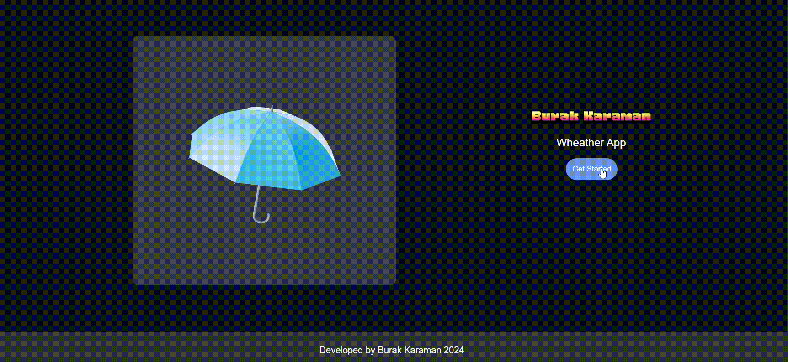

# weather-app
- <a href="https://karamanburak.github.io/wheather-app/" rel="noFollow">Access the finished project online</a>

## Description

This project is a simple weather application. The project is developed with JavaScript. The project aims to access the instant weather of a searched city or province. At the same time, with the location information, the current weather conditions of the current region can be accessed. It can be used in English, German and Turkish. The `OpenWeather API` was used to develop this project.

## Project Skeleton

```
Shopping Cart (folder)
|
SOLUTION
├── assets
│     └── [images]    
├── weather-page
│      ├── clock.js
│      ├── weather.css
│      ├── weather.html
│      └── weather.js
├── app.js
├── index.html
├── README.md
└── style.css

```

## Outcome




User story;

  - User can search city around the world.
  - The app can fetch api with the searched city name(... and apikey if it is obligatory).
  - User can display weather data of searched city in weather card.
  - User can display list of searched city weather data card like on gif.
  - If new searched city is in the weather data list, app can display a warning text to user on page.

🔥 You can use [OpenWeather Api](https://openweathermap.org/) for your app. 
